# LangGraph Implementation Architecture

## Current LangGraph Pipeline Architecture

```mermaid
graph TD
    %% Entry Point
    Start([User Query]) --> Pipeline[AnalystRAGPipeline]
    
    %% Pipeline Components
    Pipeline --> StateGraph[StateGraph with AgentState]
    StateGraph --> Memory[MemorySaver]
    
    %% Agent Flow
    StateGraph --> QO[QueryOptimizerAgent]
    QO --> DE[DataExtractorAgent]
    DE --> RF[ResponseFormatterAgent]
    RF --> End([Final Response])
    
    %% QueryOptimizerAgent Details
    QO --> LLMProvider1[LLM Provider Factory]
    LLMProvider1 --> OpenAI1[OpenAI Provider]
    LLMProvider1 --> Anthropic1[Anthropic Provider]
    LLMProvider1 --> Gemini1[Gemini Provider]
    
    QO --> PromptTemplate[Query Optimization Template]
    PromptTemplate --> DateContext[Date Context Processing]
    
    %% DataExtractorAgent Details (TODO Implementation)
    DE --> ToolFactory[Tool Factory]
    ToolFactory --> WorkspaceTool[Workspace Tool]
    ToolFactory --> CompanyTool[Company Tool]
    ToolFactory --> PeopleTool[People Tool]
    ToolFactory --> EmailTool[Email Tool]
    ToolFactory --> InteractionTool[Interaction Tool]
    ToolFactory --> GroupTool[Group Tool]
    
    %% Tool Base Architecture
    WorkspaceTool --> BaseTool[Base Tool]
    CompanyTool --> BaseTool
    PeopleTool --> BaseTool
    EmailTool --> BaseTool
    InteractionTool --> BaseTool
    GroupTool --> BaseTool
    
    %% Base Tool Features
    BaseTool --> Cache[Redis Cache]
    BaseTool --> Validation[Workspace Access Validation]
    BaseTool --> Logging[Operation Logging]
    BaseTool --> ErrorHandling[Error Handling]
    
    %% Database Connections
    WorkspaceTool --> PrismaDB[(Prisma Database)]
    CompanyTool --> PrismaDB
    PeopleTool --> PrismaDB
    EmailTool --> PrismaDB
    InteractionTool --> PrismaDB
    GroupTool --> PrismaDB
    
    %% ResponseFormatterAgent Details (TODO Implementation)
    RF --> LLMProvider2[LLM Provider Factory]
    LLMProvider2 --> OpenAI2[OpenAI Provider]
    LLMProvider2 --> Anthropic2[Anthropic Provider]
    LLMProvider2 --> Gemini2[Gemini Provider]
    
    %% State Management
    StateGraph --> AgentState{AgentState}
    AgentState --> UserQuery[user_query: str]
    AgentState --> OptimizedQuery[optimized_query: str]
    AgentState --> ExtractedData[extracted_data: dict]
    AgentState --> FinalResponse[final_response: dict]
    
    %% Configuration
    Pipeline --> Config[Configuration Settings]
    Config --> QueryOptConfig[QUERY_OPTIMIZER_CONFIG]
    Config --> DataExtConfig[DATA_EXTRACTOR_CONFIG]
    Config --> ResponseConfig[RESPONSE_FORMATTER_CONFIG]
    
    %% Styling
    classDef agentClass fill:#e1f5fe,stroke:#01579b,stroke-width:2px
    classDef toolClass fill:#f3e5f5,stroke:#4a148c,stroke-width:2px
    classDef dbClass fill:#e8f5e8,stroke:#1b5e20,stroke-width:2px
    classDef configClass fill:#fff3e0,stroke:#e65100,stroke-width:2px
    classDef todoClass fill:#ffebee,stroke:#c62828,stroke-width:2px,stroke-dasharray: 5 5
    
    class QO,DE,RF agentClass
    class WorkspaceTool,CompanyTool,PeopleTool,EmailTool,InteractionTool,GroupTool,BaseTool toolClass
    class PrismaDB,Cache dbClass
    class Config,QueryOptConfig,DataExtConfig,ResponseConfig configClass
    class DE,RF todoClass
```

## Key Components

### 1. **AnalystRAGPipeline** (Main Orchestrator)
- Uses LangGraph's `StateGraph` for workflow management
- Implements `MemorySaver` for state persistence
- Manages the flow between three specialized agents

### 2. **AgentState** (State Management)
- `user_query`: Original user input
- `optimized_query`: Processed query from QueryOptimizerAgent
- `extracted_data`: Data retrieved by DataExtractorAgent
- `final_response`: Formatted response from ResponseFormatterAgent

### 3. **QueryOptimizerAgent** ✅ (Implemented)
- Converts natural language queries to structured queries
- Uses LLM providers (OpenAI, Anthropic, Gemini) via factory pattern
- Handles date context processing and relative time replacement
- Fully implemented with comprehensive logging and error handling

### 4. **DataExtractorAgent** ⚠️ (Partially Implemented)
- **Status**: Placeholder implementation only
- **Intended**: Use multiple tools to search different databases and data storages
- **Tools Available**: 6 specialized tools (Workspace, Company, People, Email, Interaction, Group)
- **Architecture**: All tools inherit from `BaseTool` with caching, validation, and error handling

### 5. **ResponseFormatterAgent** ⚠️ (Partially Implemented)
- **Status**: Placeholder implementation only
- **Intended**: Format responses in proper JSON format
- **Configuration**: Separate LLM provider configuration available

### 6. **Tool Architecture** ✅ (Fully Implemented)
- **BaseTool**: Abstract base class with caching, validation, logging
- **ToolFactory**: Factory pattern for tool creation and management
- **Available Tools**: 6 domain-specific tools for different data types
- **Features**: Redis caching, workspace access validation, comprehensive error handling

### 7. **LLM Provider System** ✅ (Fully Implemented)
- **Factory Pattern**: `LLMProviderFactory` for provider creation
- **Supported Providers**: OpenAI, Anthropic, Gemini
- **Per-Agent Configuration**: Each agent can use different providers/models
- **Flexible Configuration**: Environment variable-based configuration

## Current Implementation Status

- ✅ **QueryOptimizerAgent**: Fully implemented and functional
- ⚠️ **DataExtractorAgent**: Architecture ready, implementation needed
- ⚠️ **ResponseFormatterAgent**: Architecture ready, implementation needed
- ✅ **Tool System**: Complete architecture with 6 specialized tools
- ✅ **LLM Provider System**: Fully implemented with multiple providers
- ✅ **Configuration System**: Comprehensive per-agent configuration
- ✅ **Caching & Infrastructure**: Redis caching and error handling

## Next Steps for Full Implementation

1. **Implement DataExtractorAgent**: Connect tools to actual data extraction logic
2. **Implement ResponseFormatterAgent**: Add JSON formatting with LLM assistance
3. **Complete Tool Implementations**: Finish the 6 specialized tool classes
4. **Add Database Integration**: Connect tools to actual Prisma database operations
5. **Testing**: Add comprehensive integration tests for the complete pipeline
